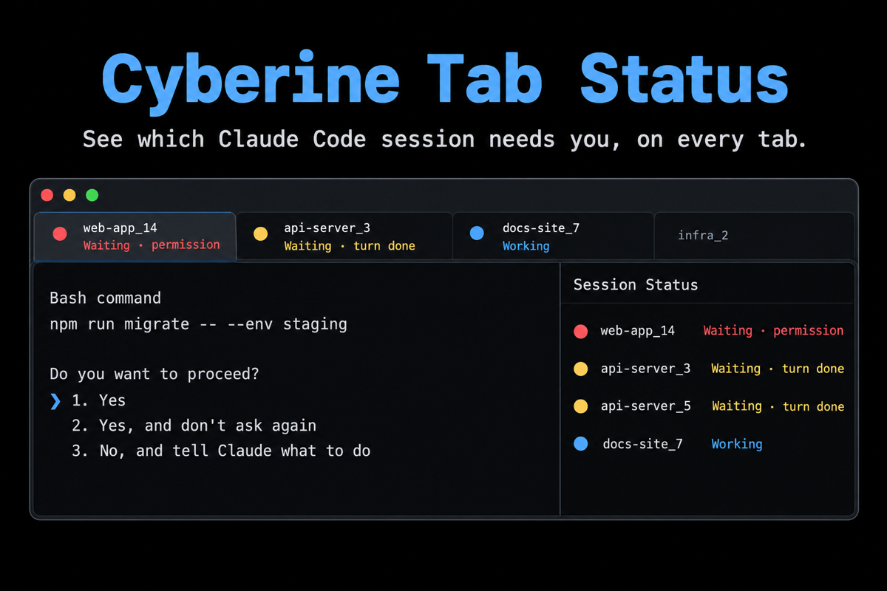

# Cyberine Tab Status



A Claude Code plugin that shows each session's state on its iTerm2 tab and in iTerm2's Session Status tool, so with many tabs and split panes you can see at a glance which session needs you.

| When | Status | Color |
|---|---|---|
| You send a prompt, or Claude finishes a tool call | Working | blue |
| Claude asks for a permission or an answer | Waiting (permission) | red |
| Claude finishes its turn | Waiting (turn done) | yellow |
| Session starts or ends | cleared | |

A tab with several panes shows the most urgent status among them. The Session Status tool (View > Toolbelt > Session Status) lists every pane on its own row, waiting ones first; click a row to jump to it. The tool is per window: it lists only the panes of the window it is shown in. A window with a single tab has no tab bar, so there the toolbelt is the only place the status shows.

## Requirements

- iTerm2 3.7 or newer (Session Status, OSC 21337).
- Inside tmux: `set -g allow-passthrough all` in `tmux.conf` (`on` only reaches panes that are currently visible).
- Anywhere other than iTerm2 (`LC_TERMINAL` is not `iTerm2`) the plugin does nothing.

## Install

Inside Claude Code:

```
/plugin marketplace add cyberinecore/cc-tabstatus
/plugin install cyberine-tabstatus@cyberine-tabstatus
```

Or from a shell:

```
claude plugin marketplace add cyberinecore/cc-tabstatus
claude plugin install cyberine-tabstatus@cyberine-tabstatus
```

From a local clone: `claude plugin marketplace add /path/to/cc-tabstatus`, or for one session `claude --plugin-dir /path/to/cc-tabstatus`.

## How it works

Each hook runs `hooks/tabstatus.sh <state>`, which writes an OSC 21337 sequence to the session's terminal. Inside tmux it resolves the pane tty from `$TMUX_PANE` and wraps the sequence in a tmux DCS passthrough, so the status lands on the right pane even though every tmux pane shares the same frozen `ITERM_SESSION_ID`. Outside tmux, hook processes have no controlling terminal, so it walks up the parent processes to the first one that has a tty (the `claude` process) and writes there.

The hooks print nothing: no message at session start, nothing added to the transcript, and nothing at all outside iTerm2. A failed write (closed tty, missing tmux pane) is dropped silently and never blocks Claude.

## Privacy

No network requests, no telemetry, no files written. Each hook reads its standard input to the end and discards it without parsing, so your prompts are never looked at. Details: `PRIVACY.md`.

## Troubleshooting

- No status on any tab: check that `echo $LC_TERMINAL` prints `iTerm2` in that pane and that iTerm2 is 3.7 or newer. Over ssh, `LC_TERMINAL` reaches the remote shell only when the ssh config sends it (`SendEnv LC_*`, the macOS default).
- Works outside tmux but not inside: run `tmux show -g allow-passthrough`; it must be `all` (or `on`, which reaches only visible panes). Set it in `tmux.conf` and run `tmux source-file ~/.tmux.conf`.
- A session that was already running when you installed the plugin shows nothing until you run `/reload-plugins` or restart it.
- The Session Status tool lists only the panes of its own window, and a window with a single tab has no tab bar, so open the toolbelt there.

## Develop

```
./tests/tabstatus.test.sh
shellcheck -S warning hooks/tabstatus.sh tests/tabstatus.test.sh
claude plugin validate . --strict
claude plugin validate .claude-plugin/plugin.json --strict
```

## License

MIT, see `LICENSE`.
